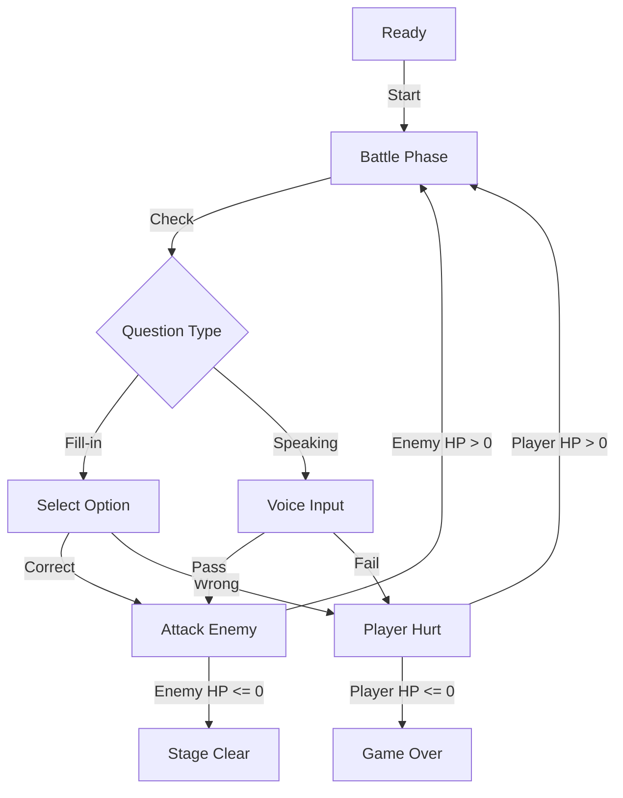

# Dungeon_Master_Core (地牢主宰核心)

## 1. 技能描述 (Description)
本技能負責管理「地牢模式」的所有遊戲狀態。它定義了一套標準化的 **Game Loop (遊戲迴圈)**，讓開發者可以專注於打造酷炫的戰鬥畫面，而不必擔心底層的倒數計時、血量扣減與勝負判定邏輯。

## 2. 核心遊戲流程 (Game Loop)



## 3. 資料結構定義 (Interfaces)

```typescript
// 遊戲階段
export type GamePhase = 'ready' | 'battle' | 'victory' | 'defeat';

// 玩家狀態
export interface PlayerState {
  hp: number;
  maxHp: number;    // default: 3 (只有 3 次機會)
  combo: number;    // 連勝次數 (影響分數)
  score: number;    // 累積得分
}

// 敵人狀態 (Boss)
export interface EnemyState {
  hp: number;
  maxHp: number;    // 取決於關卡總題數 (e.g. 5 題 -> 5 HP)
  name: string;     // e.g. "混亂魔獸·畫蛇"
  feedback: string; // 敵人說的話 (受傷/嘲諷)
}

// 題目類型
export type QuestionType = 'choice' | 'speaking'; 

export interface BattleQuestion {
  id: string;
  type: QuestionType;
  content: string;      // 題目內容 (e.g. "畫蛇添_")
  options?: string[];   // 選擇題選項
  answer?: string;      // 正確答案 (選擇題)
  keywords?: string[];  // 關鍵字 (口說題)
  timeLimit: number;    // 限時 (秒)
}
```

## 4. 戰鬥邏輯與公式 (Mechanics)

### 4.1 時間流逝 (Time Decay)
*   每題限時 **10~15 秒**。
*   時間歸零視同答錯 (Time's Up)，玩家扣 **1 HP**。

### 4.2 傷害計算 (Damage Calculation)
*   **Player Hurt**: 答錯/超時 -> 玩家 HP **-1**。
    *   *Effect*: 畫面震動 (`animate-shake`)，背景閃紅。
*   **Enemy Hurt**: 答對 -> 敵人 HP **-1**。
    *   *Effect*: 敵人縮放 (`animate-pop`)，噴出金幣/分數。

### 4.3 得分公式 (Score Formula)
*   **Base Score**: 100 分。
*   **Time Bonus**: 剩餘秒數 * 10。
*   **Combo Multiplier**: (1 + Combo * 0.1)。
*   `Final Score = (100 + Time * 10) * Multiplier`

## 5. 實作掛鉤 (React Hook Example)

建立 `useDungeonMaster` Hook，封裝 `useState` 與 `useEffect`。

```typescript
// pseudocode
const useDungeonMaster = (questions: BattleQuestion[]) => {
   const [phase, setPhase] = useState('ready');
   const [player, setPlayer] = useState({ hp: 3, maxHp: 3, combo: 0, score: 0 });
   const [enemy, setEnemy] = useState({ hp: questions.length, maxHp: questions.length });
   const [currentQ, setCurrentQ] = useState(0);
   
   // Handle Answer
   const submitAnswer = (isCorrect: boolean, timeLeft: number) => {
       if (isCorrect) {
           // Attack Logic
           const points = calculateScore(timeLeft, player.combo);
           setPlayer(p => ({ ...p, score: p.score + points, combo: p.combo + 1 }));
           setEnemy(e => ({ ...e, hp: e.hp - 1 }));
           // Check Win
           if (enemy.hp <= 1) setPhase('victory');
           else nextQuestion();
       } else {
           // Hurt Logic
           setPlayer(p => ({ ...p, hp: p.hp - 1, combo: 0 }));
           // Check Lose
           if (player.hp <= 1) setPhase('defeat');
       }
   };
   
   return { phase, player, enemy, question: questions[currentQ], submitAnswer };
};
```

## 6. 使用指南 (Usage)

1.  在 `src/hooks` 建立 `useDungeonMaster.ts`。
2.  在 `src/app/idiom-dungeon/dungeon/page.tsx` 引入該 Hook。
3.  將 UI 元件 (HealthBar, Timer) 綁定到 Hook 回傳的狀態上。
